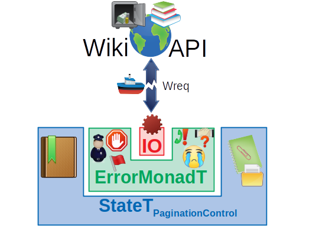

---
[(To project source)](#top) | [(Back to central personal homepage)](https://alignalghii.github.io)

---

# Monad transformers demonstrated with a search API client

## Table of contents

- [Table of contents](#table-of-contents)
- [Introduction](#introduction)
    - [Project's goals](#projects-goals)
    - [WikiMedia's search API](#wikimedias-search-api)
    - [Pagination state machine](#pagination-state-machine)
    - [State machines in various implementations](#state-machines-in-various-implementations)
- [Usage](#usage)
    - [Examples](#examples)
- [Architecture](#architecture)
    - [Theoretical stack of monad transformers](#theoretical-stack-of-monad-transformers)
    - [Factual stack](#factual-stack)
        - [Implicit, less elaborate state handling](#implicit-less-elaborate-state-handling)
        - [Simpler, less capable exception handling](#simpler-less-capable-exception-handling)
- [Meta-features: automatic tests, experiments](#meta-features-automatic-tests-experiments)
    - [Unit tests](#unit-tests)
    - [Integration tests](#integration-tests)
    - [Laziness experimentation](#laziness-experimentation)

## Introduction

### Project's goals

Monad transformers — an important field of how to design architecture for complex Haskell projects — can present a steep learning curve.
This little project tries to provide a small motivating example.

In Philip Wadler's „*[Monads for functional programming](https://homepages.inf.ed.ac.uk/wadler/topics/monads.html#marktoberdorf)*” paper, monads are introduced by demonstrating how a simple pure interpreter program can be augmented with various effects. For example, a simple pocket calculator program is presented, and developed further in a didactic manner. At first, the program is capable only of simple pure calculations, later, it is augmented by adding the capability of signaling errors to the user. Even later it can be extended also with the notions of *states* (memory registers, variables), *tracing* (output), *configurability* (environment), maybe even reading from remote sites/services (IO). All these additional features added to the core functionality can be implemented in various ways, of course it is expected to do that in a clean code, following principles of modularity, separation of concepts, lazy coupling, code reuse. Monad transformers are at least a partial and usually acceptable solution to the emerging questions.

This little project presented here tries to present monad transformers in a different example than modular interpreters. The present project works with a very simple *protocol*, uses a simple core *state machine*, and presents how accompanying *effects* can be built on top of that core functionality.

In short: the non-pedagogical, naked technical goal of the project is to provide an API client softwer to the [API:Search](https://www.mediawiki.org/wiki/API:Search) service of MediaWiki.

[(To the top of this README)](#readme) | [(To project source)](#top) | [(Back to central personal homepage)](https://alignalghii.github.io)

### WikiMedia's search API

Wikipedia has many interesting articles and other useful resources (e.g. images, videos) in the most various topics.
The user can navigate simply reading the articles and jumping through their links from article to article, or use the category labels, or read portal-like articles summarizing many fields of a broad topic. But besides all these link-based tools, there is also a search feature, mostly used by readers of Wikipedia. This feature is available not only for direct human use: Wikipedia also provides an API, capable of finding a listing various documents based on the searchphrase provided by the user.

The [API:Search](https://www.mediawiki.org/wiki/API:Search) site of MediaWiki describes the use of this API. At the URL address of the service, the searchphrase can be provided with the `&rsearch=` particle of a `GET` request. To experiment with the service interactively, here is the sandbox site for that: [API sandbox](https://en.wikipedia.org/wiki/Special:ApiSandbox#action=query&list=search&srsearch=Haskell&utf8=&format=json), exemplified here with searchphrase „*Haskell*”.

The search results come in a paginated way: the results contain

- a limited number of the found items themselves (ten ones),
- plus an optional „continuation token” — `sroffset` —, it is a natural number.

The user can provide this continuation token in his/her next search alongside with the searchprase, in order  to instruct the server to provide a continuation of the search with the next ten items. Of course, this manual work can be automated, and a client program can hide, („abstract away”) this from the users, and can provide a continuous listing of the found items. Formalizing this technique is essentially what we call a *state machine* for pagination.

[(To the top of this README)](#readme) | [(To project source)](#top) | [(Back to central personal homepage)](https://alignalghii.github.io)

### Pagination state machine

A *state machine* consists of a space of distinct *states*, and possible *transitions* between these states can be represented by arrows, usually together with conditions, input triggers and output actions. Here, for representing pagination as a special state machine, a mixed notation is shown („extended state machine”):

")

The diagrams presents and exemplifies a search process when paginated by 10-items in each page. The meaning of the diagram:

- When we use a paginated web service, usually it is implemented by augmenting both requests and response with extra information for *pagination control*.
- This pagination control is usually the presence (or a meaningful selective absence) of a *pagination token* — usually a simple natural number.
- At the first call, invoking the search service, we do not augment our request with a pagination token: its absence will be interpreted by the server as the begin of the search.
- The server will provide paginated results, together with the pagination token for continuing, and the client program keeps re-issuing the request with including also the accordingly updated pagination token having received in the former response.
- If the server reaches the last items in the actual phase of the paginated search, then it does not include a pagination token in its response.
- The client program detects this absence of pagination token as an end of the search (and the pagination process): it ceases to re-issue the request, and informs the user about thee completion of the task.

On the diagram of the state machine of the pagination, and in the explanation list, You can see that the state is an instance of some `Maybe continuationToken` type. Here, the semantics of `Nothing` is dual in a kind of sense: it has double meanings, it can represent

- either the start state in the request (the begin of the entire pagination process), if `Nothing` is attached to the request;
- but it can signinify also the end/termination when `Nothing` is coming as part of the answer.

The essence can be seen better on this simpler figure, presenting the underlying simple state machine, abstracting details away:

")

---
[(To the top of this README)](#readme) | [(To project source)](#top) | [(Back to central personal homepage)](https://alignalghii.github.io)

---

## State machines in various implementations

So, we will use *state machines* for implementing paginations. Let us see state machines in a didactic manners, according to their increasing complexity, capability, or explicitness.

The easiest example would be to show an infinite state machine, without any control to terminate. The user does not want to stop pagination, and the resources to paginate are infinite. Let us see:

```haskell
-- Pagination wthout termination handling (infinite pagination):

infinite_pagination :: Transition paginationState page -> paginationState -> [page]
infinite_pagination transitFun initialState = let (firstPage, nextState) = transitFun initialState
                                              in firstPage : infinite_pagination transitFun nextState
```

This can be used fro some mathematical problems. But in a real pagination situation, we have a start and an end of a pagination: for start the user/client doesn'nees to provide any extra information, and for stop the server can signal an end of the found resources to the client.

As mentioned earlier, we implement all that with adding a special single case to the „token space”
of pagination: the `Int` pagination-tokens will be wrapped as `Maybe Int`, with `Nothing` having a double meaning for both the start end the end state.

This above double meaning of `Nothing` as an either a start or and and state can be seen in the implementation:

```haskell
pagination_nonDRY :: PaginationTransition pgnToken page -> [page]
pagination_nonDRY = flip pagination_nonDRY' Nothing

pagination_nonDRY', pagination_nonDRY_end :: PaginationTransition pgnToken page -> Maybe pgnToken -> [page]
pagination_nonDRY' transitFun maybePgnToken = let (firstPage, maybeNextPgnToken) = transitFun maybePgnToken
                                              in firstPage : pagination_nonDRY_end transitFun maybeNextPgnToken
pagination_nonDRY_end transitFun maybePgnToken = case maybePgnToken of
                                                            Nothing       -> []
                                                            Just pgnToken -> let (page, maybeNextPgnToken) = transitFun maybePgnToken
                                                                             in page : pagination_nonDRY_end transitFun maybeNextPgnToken
```

The function has two variants, according to the actual „role”/„context”. Because these variants share many common patterns, a more economical solution uses a common function but augmented with a booelan flag parameter, capable of both kinds of behavior according to the flag:

```haskell
-- Pagination with termination handling and non-redundant (DRY) implementation,
-- it does not use monads (State monad) yet, instead, transition function is managed directly:

pagination_TF :: PaginationTransition pgnToken page -> [page]
pagination_TF transitionFunction = pagination_TF' True transitionFunction Nothing

pagination_TF' :: Bool -> PaginationTransition pgnToken page -> Maybe pgnToken -> [page]
pagination_TF' isStartMode transitionFunction maybePgnToken
    | isStartMode || isJust maybePgnToken = let (firstPage, maybeNextPgnToken) = transitionFunction maybePgnToken
                                            in firstPage : pagination_TF' False transitionFunction maybeNextPgnToken
    | otherwise                           = []
```

The above definitions operate with *state transitions* — so a state machine is represented as a function, a state transition. But we can represent a state machine much more explicitly with a `State` monad:

```haskell
pagination_SM :: PaginationState pgnToken page -> [page]
pagination_SM = flip evalState Nothing . pagination_SM' True

pagination_SM' :: Bool -> PaginationState pgnToken page -> PaginationState pgnToken [page]
pagination_SM' isStartMode transition = do
        maybeToken <- get
        if isStartMode || isJust maybeToken
            then liftM2 (:) transition $ pagination_SM' False transition
            else return []
```

So, You can see how we are proceeding from implicit approaches towards more explicit representations of the topics. Still, all the above solutions can represent only pure state machines. But managing an API with a server is not just a pure state machine: there can be errors, and more importantly, the whole connection is a „dirty” IO. So we must consider „dirty” state machines, more precisely said, state machines with some *effects* on top of them. Such things can be described by *monad transformers*:

```haskell
pagination_MT :: Monad effect => PaginationStateT pgnToken effect page -> effect [page]
pagination_MT = flip evalStateT Nothing . pagination_MT' True

pagination_MT' :: Monad effect => Bool -> PaginationStateT pgnToken effect page -> PaginationStateT pgnToken effect [page]
pagination_MT' isStartMode transitEffect = do
    maybePgnToken <- get
    if isStartMode || isJust maybePgnToken
        then liftM2 (:) transitEffect $ pagination_MT' False transitEffect
        else return []
```

Despite of the conciseness of the above, the actual programm offen uses transitional, less explicit, less nice solutions.

[(To the top of this README)](#readme) | [(To project source)](#top) | [(Back to central personal homepage)](https://alignalghii.github.io)

## Usage

The program is a command-line tool. `Makefile` names the executable file `client-to-MW-search-API-with-demo-MTs`. A help info can be seen when calling the program name alone, or with option `--help`:

```
me@my-computer:~/haskell/crawler$ ./client-to-MW-search-API-with-demo-MTs --help
Usage: client-to-MW-search-API-with-demo-MTs <OPTION>
where <OPTION> can be *one* of the following options:
  -S <EXPR>  --search=<EXPR>, --service=<EXPR>   # Consult with Wikipedia's search service: search for <EXPR>
  -t         --test                              # Run unit tests
  -h, -?     --help                              # Info about the command-line interface (flags, options)

Abbreviations:
    `client-to-MW-search-API-with-demo-MTs` alone is interpreted as `client-to-MW-search-API-with-demo-MTs --help`
    `client-to-MW-search-API-with-demo-MTs <EXPR>` is interpreted as `client-to-MW-search-API-with-demo-MTs --search <EXPR>`
me@my-computer:~/haskell/crawler$
```

### Examples

---
[(To the top of this README)](#readme) | [(To project source)](#top) | [(Back to central personal homepage)](https://alignalghii.github.io)

---

The most  useful command-line options are `--search=`, and its improved version, `--paginate=`. Both these options require a searchphrase argument. For example, if the user wants to see a few Wikipedia article titles for searchphrase „Haskell”, he/hse can issue the command
```
./client-to-MW-search-API-with-demo-MTs --search=Haskell
```
But if she/he wants to get more search results than the first ten items (i.e. he/she wants to paginate among the result interactively, or even wants to see all results), then he/she must issue
```
./client-to-MW-search-API-with-demo-MTs --paginate=Haskell
```

An example for the most common case: there are so many result items that pagination is needed:

```
me@my-computer:~/haskell/crawler$ ./client-to-MW-search-API-with-demo-MTs --search=Haskell
Service: first-page of search result for searchphase `Haskell'
 - Haskell
 - Haskell (programming language)
 - Will Haskell
 - Colleen Haskell
 - James Haskell
 - Eddie Haskell
 - Gordon Haskell
 - Haskell Curry
 - Floyd Haskell
 - Peter Haskell
There are more results, repeat seach with &sroffset=10
me@my-computer:~/haskell/crawler$
```

As the example shows, `--search=` is a rather low-level option, the need for pagination is signaled to the user, but the command does not help in that any further. The behavior of the more developed `--paginate=` option is more user-friendly in pagination:

```
me@my-computer:~/haskell/crawler$ ./client-to-MW-search-API-with-demo-MTs --paginate=Haskell
Service: paginated search result for searchphase `Haskell'
 - Haskell
 - Haskell (programming language)
 - Will Haskell
 - James Haskell
 - Gordon Haskell
 - Colleen Haskell
 - Eddie Haskell
 - Haskell (surname)
 - Miriam Haskell
 - David Haskell
Type `y' or `yes' to continue search, anything else (or a single ENTER) to cancel! (Continuation token: 10)
yes
 - Miriam Haskell
 - Haskell Wexler
 - Peter Haskell
 - Haskell Platform
 - Haskell (company)
 - Molly Haskell
 - Glasgow Haskell Compiler
 - Haskell Curry
 - Neil Haskell
 - Haskell Indian Nations University
Type `y' or `yes' to continue search, anything else (or a single ENTER) to cancel! (Continuation token: 20)
yes
 - Haskell, Oklahoma
 - Haskell Garrett
 - Jamie Haskell
 - Liquid Haskell
 - Floyd Haskell
 - Todd Philip Haskell
 - Haskell features
 - Edward Haskell
 - Haskell Stakes
 - Haskell, Texas
Type `y' or `yes' to continue search, anything else (or a single ENTER) to cancel! (Continuation token: 30)
no
me@my-computer:~/haskell/crawler$
```

An example where pagination is not needed, because there are fewer than 10 result title items:

```
me@my-computer:~/haskell/crawler$ ./client-to-MW-search-API-with-demo-MTs --search=Vackor
Service: first-page of search result for searchphase `Vackor'
 - Vackor az első bében
 - Europa postage stamp
 - Proton Theatre
No more search results
me@my-computer:~/haskell/crawler$
```

An example where pagination is not needed, because there are no result title items at all:

```
me@my-computer:~/haskell/crawler$ ./client-to-MW-search-API-with-demo-MTs --search=tughneghaq
Service: first-page of search result for searchphase `tughneghaq'
No more search results
me@my-computer:~/haskell/crawler$
```

---
[(To the top of this README)](#readme) | [(To project source)](#top) | [(Back to central personal homepage)](https://alignalghii.github.io)

---

## Architecture

### Theoretical stack of monad transformers



The overall architecture can be presented in a concise way:

```haskell
type Architecture = StateT PaginationControl (ErrorMonadT IO) [DocumentTitle]
```

with the following types:

```haskell
type PaginationToken   = Int
type PaginationControl = Maybe PaginationToken -- Both the start and stop states are represented by `Nothing`

data ErrorType          = FailedConnection | UnexpectedResponseFormat
type ErrorMonad         = Either ErrorType
newtype ErrorMonadT m a = ErrorMonadT {runErrorMonadT :: m (ErrorMonad a)}

type DocumentTitle = String
```

---
[(To the top of this README)](#readme) | [(To project source)](#top) | [(Back to central personal homepage)](https://alignalghii.github.io)

---

### Factual stack

#### Implicit, less elaborate state handling

Practically, in the current stage of the development, a lot of more low-level solutions are used. Contentually, they express the same, as the above scheme, but they have not yet been brought to this conceptually clear format.

For example, often a transition function is used instead of an explicit state monad. In all these cases, an implicit state monad is hiding behind the use and the context of the transition function.

The project intends to be somewhat didactical and historical here (at the cost of losing conciseness). The following modules present a kind of wandering from the most naive styles of state representations toward more and more explicit and standard formalisms:

- `Control`
    - [`Transition`](src/Control/Transition.hs)
    - [`Pagination`](src/Control/Pagination.hs)
- `PaginationStatemachines`
    - `Effectless`
        - [`PaginationConceptSeries`](src/PaginationStateMachines/Effectless/PaginationConceptSeries.hs)
        - [`PaginationConceptSeriesSpec`](src/PaginationStateMachines/Effectless/PaginationConceptSeriesSpec.hs)
    - `Effectful`
        - [`PaginationConceptSeries`](src/PaginationStateMachines/Effectful/PaginationConceptSeries.hs)
        - [`PaginationConceptSeriesSpec`](src/PaginationStateMachines/Effectful/PaginationConceptSeriesSpec.hs)

---
[(To the top of this README)](#readme) | [(To project source)](#top) | [(Back to central personal homepage)](https://alignalghii.github.io)

---

#### Simpler, less capable exception handling

In the factual stack of monad transformers, instead of `ErrorMonadT` the much simpler `MaybeT` monad transformer is used yet. The cost of this simplification: the `Maybe`-represented case in the stack can handle only exceptions of „*unexpected server response format*”. The other possibility of exception — server connection error — will be caught only by `IO` monad in the native way.

## Meta-features: automatic tests, experiments

### Unit tests


Unit tests can be invoked by the user simply as part of the command-line options:

```
me@my-computer:~/haskell/crawler$ ./client-to-MW-search-API-with-demo-MTs --unit-test

Infinite effectless pagination
  Both infinite state-jumps and finite state-jumps can have an infinite runtime
    God's infinite book with infinite state-jumps
    A ticking clock with finite state-jumps but infinite runtime
Limitable effectless pagination
  There are only four seasons, the sample is limited
    simple-function non-DRY solution
    simple-function but more economical (DRY) solution
    State-monad solution
Effectful pagination
  Biliography server
    Without state transformer
    With state transformer

Finished in 0.0063 seconds
7 examples, 0 failures
me@my-computer:~/haskell/crawler$
```

Technically, in the surcecode, unit tests are „pure” tests on a state machine without the „unpure” `IO` monad:

- `PaginationStatemachines`
    - `Effectless`
        - [`PaginationConceptSeries`](src/PaginationStateMachines/Effectless/PaginationConceptSeries.hs)
        - [`PaginationConceptSeriesSpec`](src/PaginationStateMachines/Effectless/PaginationConceptSeriesSpec.hs)


Even those monad transformers are tested without `IO`, which work together in the edge application with `IO`. In their corresponding unit test the `IO` part of their transfomer stack is replaced with the „harmless”, „purer” `ErrorMonad`:

- `Effectful`
    - [`PaginationConceptSeries`](src/PaginationStateMachines/Effectful/PaginationConceptSeries.hs)
    - [`PaginationConceptSeriesSpec`](src/PaginationStateMachines/Effectful/PaginationConceptSeriesSpec.hs)

[(To the top of this README)](#readme) | [(To project source)](#top) | [(Back to central personal homepage)](https://alignalghii.github.io)

### Integration tests

In the recent state of the development, there is only one intergration testcase. It provokes a wrong reponse format from the server, and checks whether the client can handle it in its intended high-level architecture design (details: it is the `MaybeT` monad transformer in the overall stack, serving as a poor man's `ErrorMonadT`).

```
me@my-computer:~/haskell/crawler$ ./client-to-MW-search-API-with-demo-MTs --intgr-test
Integration tests:
  ✓  Invalid JSON format response from server is handler by this client correctly: True
me@my-computer:~/haskell/crawler$
```

The integration test is implemented in the sourcecode like this:


- `MetaFeatures`
    - [`IntegrationTest`](src/MetaFeatures/IntegrationTest.hs)

---
[(To the top of this README)](#readme) | [(To project source)](#top) | [(Back to central personal homepage)](https://alignalghii.github.io)

---

### Laziness experimentation

The third kind of „metafeatures” of the program are the „laziness experimentations”. They are almost like integrated tests, but they do not test any existing feature of the client. Instead, they are like a mini research project of its own, although they are distantly connected to the topics of the program too.

In an ideal world, a paginated service use by the client would look somehing like this (for simplicity's sake the `ErrorMonadT` layer is ommitted):

```haskell
type PaginationToken = Int
type PaginationToken = Maybe PaginationToken -- `Nothing` denotes the start and the stop state

singleTransition :: StateT PaginationControl IO [Title]
singleTransition = ...

paginate :: StateT PaginationControl IO [Title] -> StateT PaginationControl IO [[Title]]
paginate = ...

main :: IO ()
main = interact $ representationWrapper $ runStateT $ paginate singleTranslation Nothing
```

This approach builds upon lazy evaluation very heavily. So heavily, that it does not work! It seems that our architecture cannot be that lazy. Even is we use the lazy `StateT` instead of the strict one, it cannot preserve laziness through the `IO` monad (moreover, even not through the `Maybe` monad!)

Thus, the real implementation of the client uses a more defensive architecture, that does not rely on lazy evaluation at all. But as a kind of self-documentation, the program has a kind of special integrated test — or better to say, a kind of demo — on „laziness experimentation”. Due to its possibly infinite (runaway) nature, it is implemented using concurrency and timing:

- `MetaFeatures`
    - [`LazinessDemo`](src/MetaFeatures/LazinessDemo.hs)

The command-line invocation of the laziness experimentation is like this:

```
Laziness of Identity, Maybe and IO monads on top of lazy State monad transformer:
=================================================================================
 ✓  laziness of the lazy State monad: [0,1,2,3,4,5,6,7,8,9,10,11]
 ✓  laziness of Identity monad on top of the lazy State monad transformer (StateT s Identity a): Identity [0,1,2,3,4,5,6,7,8,9,10,11]
 ✕  laziness of Maybe monad on top of the lazy State monad transformer (StateT s Maybe a): <<!!-INFINITE-LOOP-!!>>
 ✕  laziness of IO monad on top of the lazy State monad transformer (StateT s IO a): <<!!-INFINITE-LOOP-!!>>
```

---
[(To the top of this README)](#readme) | [(To project source)](#top) | [(Back to central personal homepage)](https://alignalghii.github.io)

---